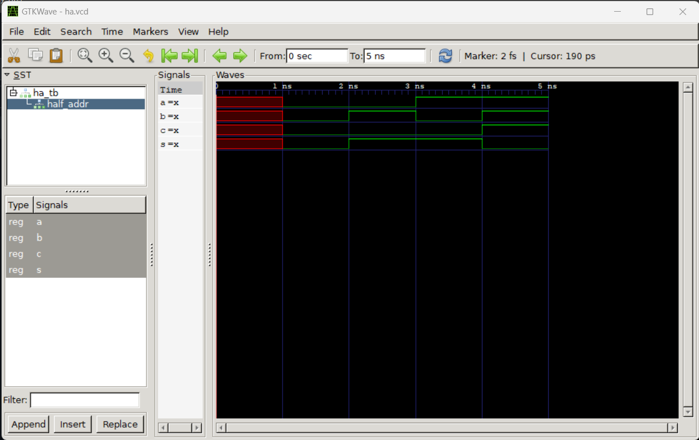

# Lab 1 — GHDL and GTKWave
Very High-Speed Integrated Circuit Hardware Description Language (VHDL) is a programming language used to model digital models.
G Hardware Design Language (GHDL) is an open-source simulator, compiler, and VHDL analyzer for the VHDL language. The G has no meaning.
## Installing GHDL and GTKWave
To start using VHDL, I followed the tutorial ['Getting Started With VHDL on Windows (GHDL & GTKWave)'](https://www.youtube.com/watch?v=H2GyAIYwZbw) by Nerdy Wave.
After installing GHDL and GTKWave, I ran my first 'Hello, World' using GHDL to make sure it was working correctly.

## Half Adder

