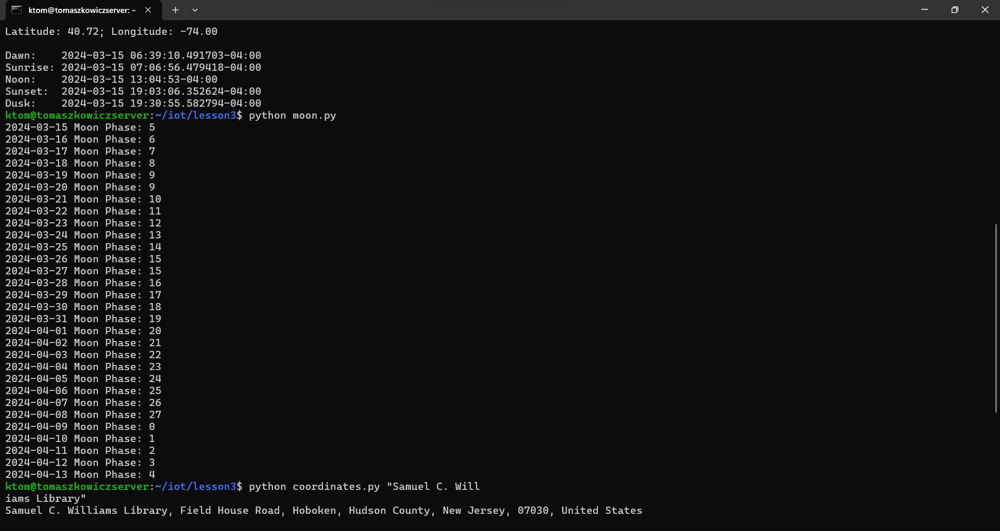

# Lab 3 — Python
## Installing Python and Python packages
I first installed Python using the following commands:
```
$ sudo apt update
$ sudo apt install python3-pip
$ sudo apt install python-is-python3
```
I then installed the required Python packages such as jdcal, astral, and geopy:
```
$ sudo pip3 install -U jdcal astral geopy
```
## Screenshots from the command line



