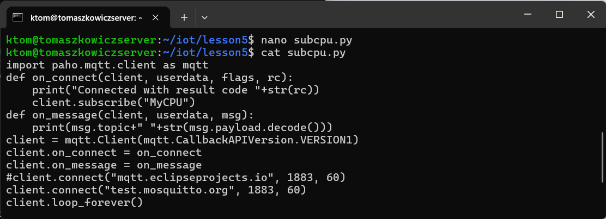
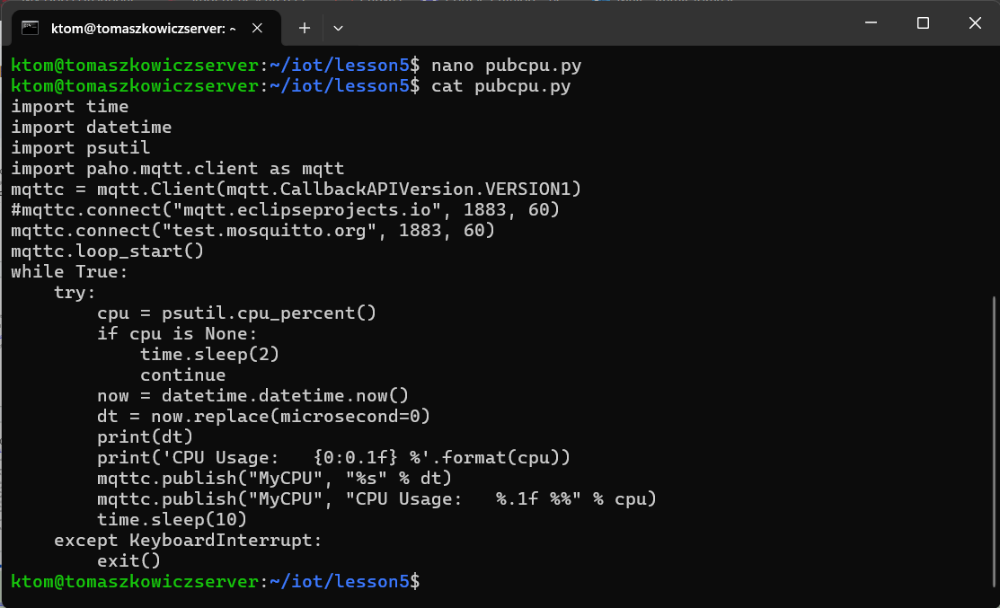
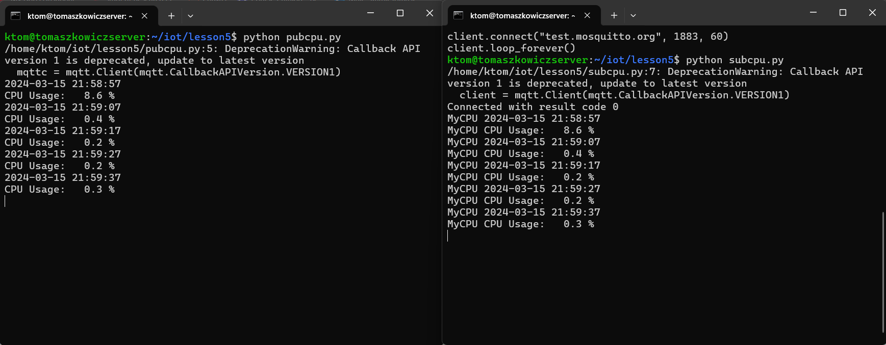

# Lab 5 — Paho-MQTT
## Installing Paho-MQTT
I first ran the following commands to install Paho
```
$ sudo apt update
$ pip3 install -U paho-mqtt
```
After installing Paho, I attempted to run python3 subcpu.py, but instead received an error saying that `mqtt.Client()` was missing an argument.
I fixed this by adding `mqtt.CallbackAPIVersion.VERSION1` to `mqtt.Client()`.



