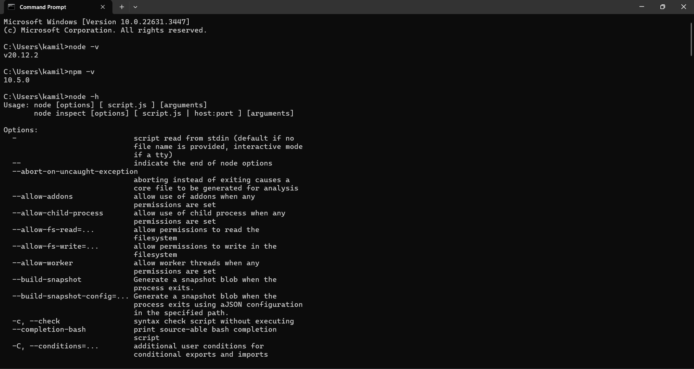
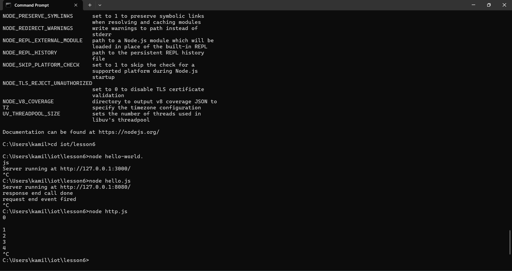
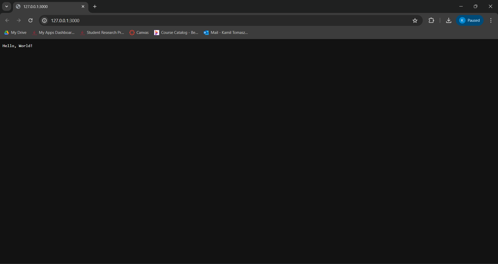
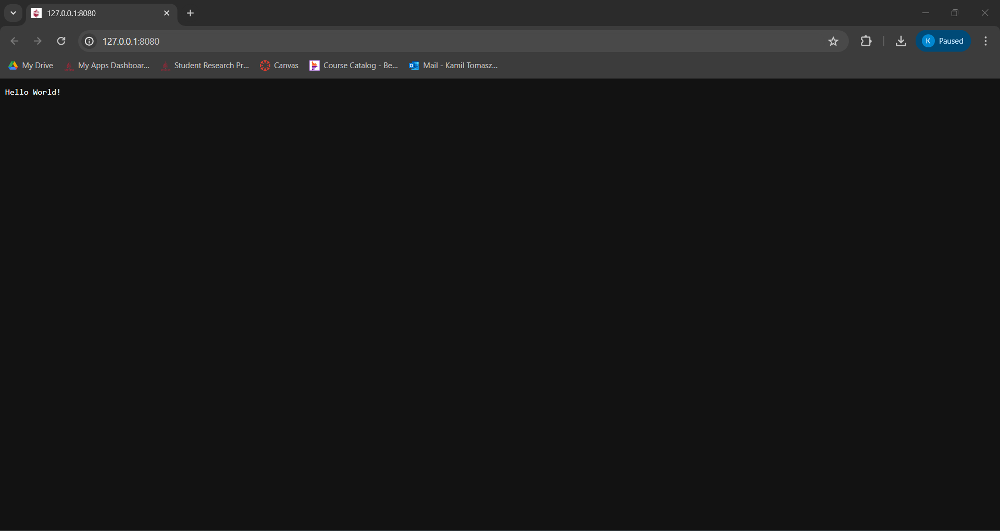
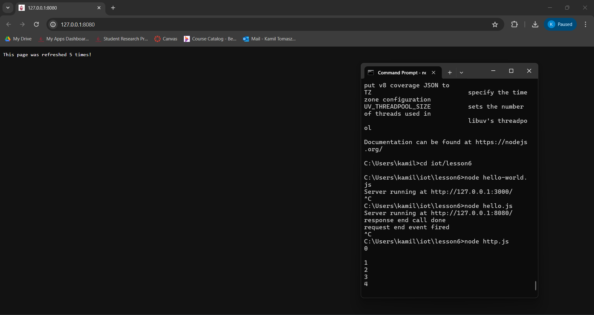

# Lab 6 — Node.js and Pystache
## Installing Node.js and Pystache
I first installed Node.js through the [website](https://nodejs.org/en/download/). I then opened a terminal and installed Pystache using the following commands
```
$ sudo apt update
$ pip3 install Pystache
```
After installing the required packages, I ran hello-world.js, hello.js, and http.js.






